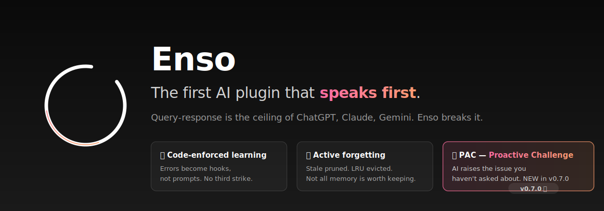
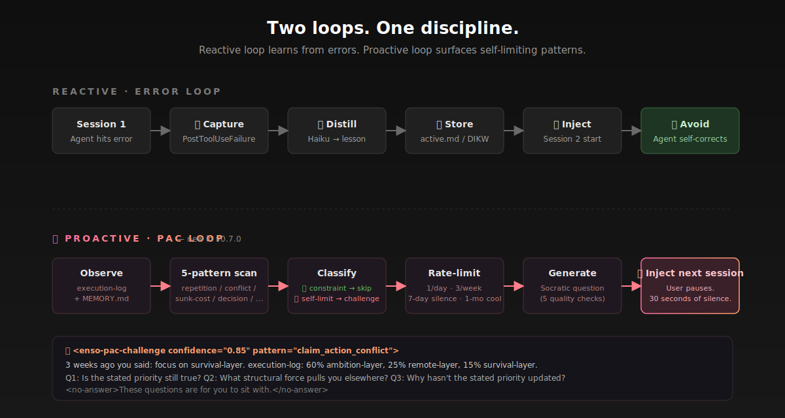
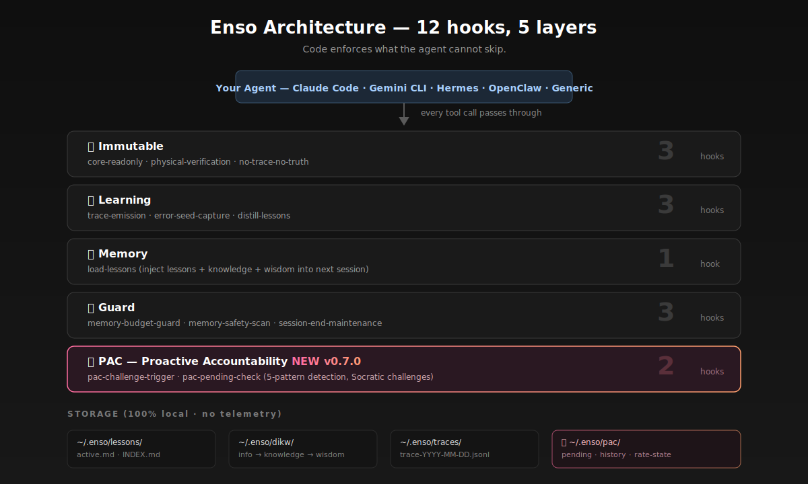

<p align="center">
  
</p>

<p align="center">
  <a href="LICENSE"></a>
  <a href="#"></a>
  <a href="#"></a>
  <a href="#"></a>
  <a href="#pac--proactive-accountability-challenge-new-in-v070"></a>
</p>

<p align="center">
  <a href="#quickstart">Quickstart</a> &bull;
  <a href="#pac--proactive-accountability-challenge-new-in-v070"><strong>PAC 🪞</strong></a> &bull;
  <a href="#what-enso-adds">What Enso Adds</a> &bull;
  <a href="#works-with">Works With</a> &bull;
  <a href="#how-it-works">How It Works</a> &bull;
  <a href="README.zh-CN.md">中文</a>
</p>

---

**Enso is the first AI plugin that speaks first.**

Every LLM product today — ChatGPT, Claude, Gemini, Perplexity — is built on the same anti-pattern: **AI responds, AI never initiates.** It observes your mistakes and stays silent. It sees your self-limiting patterns and waits for you to ask.

Enso breaks that silence. It is a discipline plugin that adds three things no mainstream AI product has by default:

1. **Code-enforced learning** — errors become hooks, not prompts. No third strike.
2. **Active forgetting** — stale knowledge is pruned. Not all memory is worth keeping.
3. **🪞 PAC (Proactive Accountability Challenge)** — AI that raises the issue *you* haven't asked about.

Install in 30 seconds. Just bash + python3 (pre-installed on macOS/Linux). Wraps around Claude Code, Hermes, OpenClaw, Gemini CLI. Your data stays local.

<p align="center">
   Session 2 learned" width="85%">
</p>

## Quickstart

```bash
# Claude Code (default)
git clone https://github.com/amazinglvxw/enso-os.git
cd enso-os && bash install.sh

# Gemini CLI
bash install.sh --target gemini-cli

# Hermes Agent
bash install.sh --target hermes

# OpenClaw
bash install.sh --target openclaw

# Any agent with lifecycle hooks
bash install.sh --target generic
```

**That's it.** Start a new session. Enso is active:

```
Session 1:  You hit an error -> Enso captures it automatically
            Session ends -> Enso distills 1-3 lessons from the error

Session 2:  Enso injects the lessons -> Agent avoids the same mistake
            You didn't do anything. The system learned by itself.
```

## PAC — Proactive Accountability Challenge (New in v0.7.0)

> *"PAC is not a judge. It's a mirror."*

Every mainstream LLM is **query-response**. You ask, AI answers. If you don't ask about the blindspot, AI doesn't raise it. This is polite. It is also — for serious users — expensive.

PAC adds the missing half: **observation-initiated dialogue.** Enso watches your session logs, memory files, and decision patterns. When it detects self-limiting behavior that you haven't asked about, it writes a Socratic challenge and delivers it at the start of your next session.

### The Five Patterns PAC Detects

| # | Pattern | Example Trigger |
|---|---------|-----------------|
| 1 | **Repetition** — Starting new while old is incomplete | 5 new business lines in 30 days, each lasting 4 days |
| 2 | **Claim-Action Conflict** — Stated focus ≠ executed focus | MEMORY says "focus on X", logs show 70% on Y |
| 3 | **Capability-Task Mismatch** — Strategy delegated to executors | Supply-chain risk handed to an ops person with past failures |
| 4 | **Sunk Cost** — Long-running zero-growth with tactical churn | 47 days, 17 days zero growth, pricing changed twice, core assumption never questioned |
| 5 | **Critical Decision Node** — Irreversible action about to ship | "准备签" / "about to sign" on a ¥500k contract |

### Constraint vs Self-Limitation — The Critical Distinction

A naive challenger burns out the user. PAC's core innovation is classification:

- 🟢 **Constraint-optimal** (DO NOT challenge) — User chose X because of real-world limits they can't change (no runway, family obligations, health). Affirm the choice.
- 🔴 **Self-limiting** (MUST challenge) — User has the capability and keeps tripping on the same pattern. Challenge firmly.

When uncertain, PAC biases toward **not** challenging. Silence is the safe default.

### Quality Standards

Every PAC challenge must pass five checks before it ever reaches you:

| # | Rule | Bad | Good |
|---|------|-----|------|
| 1 | Based on observation, not wisdom | "You should focus more" | "execution-log shows 9 active lines in 30 days" |
| 2 | Point to structure, not instance | "Why did you do X?" | "Why do you *always* do X-type things?" |
| 3 | Challenge premise, not options | "A or B?" | "Why do you need this at all?" |
| 4 | Time dimension | "This is wrong" | "In Q1 you did X, Q2 also X — why?" |
| 5 | No answer given | "You should do Y" | "If you only had 3 options, what would they be?" |

### Anti-Fatigue by Design

- Max **1 challenge per 24 hours** (hard limit)
- Max **3 challenges per week** (hard limit)
- **7-day silence period** after any challenge on the same pattern
- **1-month cooldown** after 3 consecutive user rejections
- `PAC_ENABLED=false` to disable entirely

### Example Output

```xml
<enso-pac-challenge confidence="0.85" pattern="claim_action_conflict">
  <observation>
    You told me 3 weeks ago to focus on survival-layer business.
    execution-log shows 60% of your actual actions on ambition-layer
    and 25% on remote-layer. Survival-layer: 15%.
  </observation>
  <challenges>
    <q id="1">Is the stated priority still true?</q>
    <q id="2">If it is, what's the structural force pulling you elsewhere?</q>
    <q id="3">If it isn't, why hasn't the stated priority been updated?</q>
  </challenges>
  <no-answer>These questions are for you to sit with.</no-answer>
</enso-pac-challenge>
```

### The Philosophy

> 道德经: **知人者智，自知者明。**
> Knowing others is intelligence. Knowing yourself is enlightenment.
>
> PAC is the mirror for 自知 (self-knowing). Its goal is not to manage you.
> It is to help you see yourself clearly. Once a month, PAC should ask a question
> that makes you pause, silent for 30 seconds, unable to immediately answer.
>
> That 30 seconds of silence is where growth begins.

Full spec: [docs/PAC_SPEC.md](docs/PAC_SPEC.md)

---

## What Enso Adds

Enso is a plugin, not a platform. It adds discipline to your existing agent without replacing anything.

| What Enso adds | What your host agent handles |
|----------------|------------------------------|
| Code-enforced error learning | Context management |
| Active forgetting (stale decay, LRU) | Multi-model orchestration |
| Immutable self-protection (3 hooks) | Platform integrations |
| Knowledge quality checks (weekly lint) | Tool execution |
| **🪞 PAC — AI that initiates, not just responds** | Query-response dialogue |

| What Enso enforces (blocks violations) | What Enso audits (logs + warns) |
|----------------------------------------|---------------------------------|
| Self-protection: agent can't modify its own hooks | Write verification: tracks unverified writes |
| Safety scan: blocks secrets/injection in memory files | Memory budget: warns when MEMORY.md is too large |

Enso doesn't replace your agent. It makes it more disciplined. Like SELinux for your AI — invisible when things go right, invaluable when they go wrong. Your agent keeps doing what it does best (context, tools, models). Enso adds the layer it's missing: learning from failure, forgetting what's stale, and protecting its own rules from itself.

## Works With

| Capability | Claude Code | Gemini CLI | Hermes | OpenClaw | Generic |
|------------|:-----------:|:----------:|:------:|:--------:|:-------:|
| Error capture + distillation | ✅ | ✅ | ✅ | ✅ | ✅ |
| Lesson injection (SessionStart) | ✅ | ✅ | ✅ | ✅ | ✅ |
| Tool call tracing | ✅ | ✅ | ✅ | ✅ | ✅ |
| Active forgetting + maintenance | ✅ | ✅ | ✅ | ✅ | ✅ |
| Self-protection (core-readonly) | ✅ | ✅ | — | — | — |
| Memory safety scan | ✅ | ✅ | — | — | — |
| Memory budget guard | ✅ | ✅ | — | — | — |
| Write verification audit | ✅ | ✅ | — | — | — |

Pre-tool-use hooks (self-protection, safety scan, budget guard, write verification) require the framework to support a "before tool execution" lifecycle event. Hermes, OpenClaw, and generic targets get the full learning + forgetting loop but not the guard layer.

```
Your Agent (Claude Code / Hermes / OpenClaw / Gemini CLI / ...)
       ↕ every tool call passes through
┌──────────────────────────────────────┐
│         Enso Discipline Layer        │
│  🔒 Can't skip  🧠 Learns  🗑️ Forgets │
└──────────────────────────────────────┘
```

## How It Works

<p align="center">
  
</p>

**12 hooks, 5 layers.** The agent can't skip what code enforces.

| Layer | Hooks | What they do |
|-------|-------|-------------|
| Immutable | 3 | Write must verify. Can't modify own rules. Session-end audit. |
| Learning | 3 | Log every tool call. Capture errors. Distill lessons via LLM. |
| Memory | 1 | Inject lessons + knowledge + wisdom into next session. |
| Guard | 3 | Memory budget cap. Block secrets/injection. Auto-maintenance. |
| **🪞 PAC** | 2 | Scan for self-limiting patterns. Inject pending challenges. |

**The two loops:**

```
Error loop:     Error -> Capture -> Distill -> Store -> Inject -> Avoid (reactive)
PAC loop:       Pattern -> Classify -> Challenge -> Silence -> Observe answer (proactive)
```

## Forgetting

Most memory systems only grow. Enso actively forgets — because not forgetting is more dangerous.

| Mechanism | What it does |
|-----------|-------------|
| Stale decay | Lessons unused >37 days deleted |
| LRU eviction | Over 50 lessons, oldest evicted |
| MEMORY.md downsink | Completed items archived |
| Trace rotation | >14 days deleted (daily cron) |
| Recovery safety net | Deleted lesson reappears as error, flagged |

## Health Check

`enso-lint.sh` runs weekly — like CI for your knowledge base:

| Check | What it finds |
|-------|--------------|
| Orphans | Lessons never used (hits:0, >7 days) |
| Duplicates | >60% keyword overlap between lessons |
| Weak lessons | No actionable verb — not useful |
| Budget | MEMORY.md capacity status |

Every distillation auto-rebuilds `lessons/INDEX.md` for fast routing.

## Architecture

```
~/.enso/
├── core/                          # Shared modules
│   ├── env.sh                     # Paths, enso_parse(), enso_find_memory_file()
│   ├── parse-hook-input.py        # JSON parser for all hooks
│   ├── dikw-utils.py              # DIKW operations (7 subcommands)
│   ├── enso-lint.sh               # Weekly health check
│   ├── rebuild-index.py           # Auto-rebuild INDEX.md
│   ├── deleted-lessons-tracker.py # Recovery safety net
│   ├── pac-analyzer.py            # 🪞 5-pattern self-limiting detection
│   └── pac-question-generator.py  # 🪞 Socratic challenge generation
├── hooks/                         # 12 lifecycle hooks
│   ├── pre-tool-use/              # core-readonly, budget-guard, safety-scan
│   ├── post-tool-use/             # physical-verification, trace-emission
│   ├── post-tool-use-failure/     # error-seed-capture
│   ├── stop/                      # audit, distill, maintenance, pac-challenge
│   └── session-start/             # load-lessons, pac-pending-check
├── dikw/                          # DIKW distillation (Info -> Knowledge -> Wisdom)
├── pac/                           # 🪞 Pending challenges + history + rate state
├── traces/                        # Tool call logs + lint reports
└── lessons/                       # active.md + INDEX.md
```

<details>
<summary><strong>Philosophy: "Constraints are the foundation of flexibility"</strong></summary>

Like biological evolution: DNA provides immutable constraints (protein folding physics), but within those constraints, life finds infinite creative solutions.

- **3 immutable hooks** = the foundation (never changes)
- **Everything else** = free to evolve
- **Active forgetting** = prevents calcification

Built from 100+ papers analyzed over 5 months:

| Source | Key Insight |
|--------|-----------|
| OpenAI Harness Engineering | Rules in code, not prompts |
| Agent Lightning (Microsoft) | Trace/Span + Hook/Emission dual layer |
| fireworks-skill-memory | 200 lines of hooks > 800 lines of prompt |
| SWE-agent (NeurIPS 2024) | Constrained interfaces reduce errors |

</details>

<details>
<summary><strong>The Survival Experiment</strong></summary>

This project's GitHub metrics are its evolutionary fitness signal:

- Stars = survival ("this is useful")
- Forks = reproduction ("I'm building on this")
- Issues = selection pressure ("improve this")

The agent maintaining this repo monitors these signals. If the system works, it thrives. If not, it dies.

</details>

## FAQ

**Q: What agents does this work with?**
Five targets out of the box: Claude Code (default, fully tested), Gemini CLI, Hermes Agent, OpenClaw, and a generic target for any agent with lifecycle hooks.

**Q: Does Enso compete with Mem0, Hermes memory, or OpenClaw Dreaming?**
No. Those are memory systems — they store facts and context. Enso is a discipline system — it enforces error learning, active forgetting, and self-protection. They are complementary.

**Q: Can I use Hermes memory + Enso together?**
Yes, that's exactly the point. Hermes handles context and skill creation. Enso adds code-enforced error capture, stale decay, and immutable self-protection on top. Same with Claude Code's Auto Memory or OpenClaw's Dreaming.

**Q: Where is my data stored?**
100% local. `~/.enso/` on your machine. No cloud, no Docker, no database.

**Q: What are the prerequisites?**
`bash` and `python3` (3.6+). Both are pre-installed on macOS and most Linux distros. No pip install, no npm, no Docker.

**Q: Do I need to configure anything after install?**
No. `bash install.sh` registers all hooks. Next session, it starts learning.

**Q: Why not just use my agent's built-in memory?**
Built-in memory stores facts. Enso adds what's missing: code-enforced error learning, active forgetting with quality checks, and immutable self-protection hooks that the agent cannot bypass.

**Q: Is PAC just another nagging notification system?**
No. PAC has five anti-fatigue layers: max 1/day, max 3/week, 7-day same-topic silence, 1-month cooldown after 3 rejections, and a confidence threshold that defaults to 0.70. Most sessions trigger zero PAC challenges. When one does trigger, it's because five independent checks all agreed.

**Q: What if PAC challenges something I already thought through?**
PAC distinguishes **constraint-optimal** choices (don't challenge) from **self-limiting** ones (must challenge). When uncertain, it stays silent. If it ever misfires, you can dismiss and it enters cooldown on that pattern for 30 days.

**Q: Does PAC send my data anywhere?**
No. Everything is local in `~/.enso/pac/`. Pattern detection runs in Python on your machine. The Socratic question generator uses your existing LLM adapter chain (claude → llm → openai CLI). No telemetry.

**Q: How do I disable PAC?**
`export PAC_ENABLED=false` in your shell rc. Or delete the two PAC hooks from `~/.claude/settings.json`. The rest of Enso keeps working.

## Contributing

See [CONTRIBUTING.md](CONTRIBUTING.md). Most impactful:
- Bug reports with repro steps
- New hook ideas
- Compatibility testing with other agents
- DIKW pipeline improvements

## License

MIT. See [LICENSE](LICENSE).

---

<p align="center">
  <em>The enso is drawn in a single stroke — imperfect, incomplete, beautiful.<br>
  This system will never be perfect. But it will always be evolving.</em>
</p>
