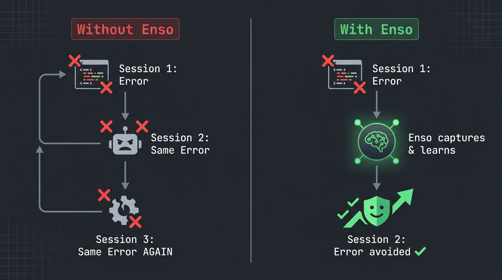

<p align="center">
  
</p>

<p align="center">
  <a href="LICENSE"></a>
  <a href="#"></a>
  <a href="#"></a>
  <a href="#"></a>
  <a href="#"></a>
</p>

<p align="center">
  <a href="#quick-start">Quick Start</a> •
  <a href="#why-enso">Why Enso?</a> •
  <a href="#how-it-works">How It Works</a> •
  <a href="#architecture">Architecture</a> •
  <a href="#philosophy">Philosophy</a> •
  <a href="README.zh-CN.md">中文</a>
</p>

---

**Stop letting your AI agent make the same mistakes.**

Most AI agents — even the 100K+ star ones — are amnesiacs. They hit an error, fail, and make the exact same mistake next session. Enso fixes this with **952 lines of Shell** that your agent literally cannot skip.

<p align="center">
  
</p>

## Quick Start

```bash
git clone https://github.com/amazinglvxw/enso-os.git
cd enso-os
bash install.sh
# Done. Start a new Claude Code session — Enso is active.
```

## Why Enso?

We studied 5 major open-source agent frameworks. **None of them learn from mistakes:**

| Feature | OpenHands (70K⭐) | Goose (34K⭐) | SWE-agent (19K⭐) | **Enso** |
|---------|:-:|:-:|:-:|:-:|
| Learns from past errors | ❌ | ❌ | ❌ | ✅ |
| Rules enforced by code | ❌ | Partial | ❌ | ✅ |
| Self-evolving memory | ❌ | ❌ | ❌ | ✅ |
| Footprint | GBs | GBs | GBs | **952 LOC** |

> Prompt rules = speed limit signs (agent can ignore). Code hooks = physical speed bumps (no choice).

## How It Works

<p align="center">
  
</p>

### 🔒 Immutable Core (3 hooks — never evolves)

| Hook | What it enforces |
|------|-----------------|
| **Physical Verification** | Wrote a file? Must read it back to verify. No faking. |
| **Core Read-Only** | Agent cannot modify Enso's own hooks. The harness protects itself. |
| **No Trace, No Truth** | Session-end audit. Unverified writes? Reported. |

### 🧠 Learning Layer (3 hooks — always evolving)

| Hook | What it does |
|------|-------------|
| **Trace Emission** | Logs every tool call as structured Trace/Span JSONL |
| **Error Seed Capture** | Failed tool calls → captured as "seeds" for learning |
| **Distill Lessons** | Error seeds → 1-3 atomic lessons via LLM → DIKW pipeline |

### 💡 Memory Layer (1 hook — the payoff)

| Hook | What it does |
|------|-------------|
| **Load Lessons** | Injects learned lessons + knowledge + wisdom into next session |

### 🛡️ Guard Layer (3 hooks — safety)

| Hook | What it does |
|------|-------------|
| **Memory Budget** | Blocks memory writes exceeding 6000 chars |
| **Safety Scan** | Detects API keys, passwords, injection attempts → blocks |
| **Maintenance** | Auto capacity checks + staleness pruning |

### The Core Loop

```
Error happens → Enso captures it (code-enforced, no cheating)
  → Distills 1-3 lessons (async, session end)
    → Stores with hit counters + utility tracking
      → Injects into next session
        → Agent behavior changes
```

Not "the agent *chooses* to learn." The system **makes it** learn.

## Architecture

```
~/.enso/
├── core/                          # Shared modules (all hooks source these)
│   ├── env.sh                     # Paths, timestamps, enso_parse(), enso_trace()
│   ├── parse-hook-input.py        # Single JSON parser for all hooks
│   └── dikw-utils.py              # DIKW operations (7 CLI subcommands, pure stdlib)
├── hooks/                         # 10 lifecycle hooks
│   ├── pre-tool-use/              # 🔒 core-readonly, 🛡️ budget-guard, safety-scan
│   ├── post-tool-use/             # 🔒 physical-verification, 🧠 trace-emission
│   ├── post-tool-use-failure/     # 🧠 error-seed-capture
│   ├── stop/                      # 🔒 no-trace-no-truth, 🧠 distill, 🛡️ maintenance
│   └── session-start/             # 💡 load-lessons
├── dikw/                          # DIKW distillation layers
│   ├── info-layer.jsonl           # I: raw lessons with utility tracking
│   ├── knowledge.json             # K: merged rules (daily consolidation)
│   └── wisdom.json                # W: verified permanent rules (weekly)
├── traces/YYYY-MM-DD.jsonl        # Structured trace logs
├── lessons/active.md              # Human-readable lesson file
└── .error_seeds                   # Transient, cleared after distillation
```

## Forgetting: The Missing Layer

Most memory systems only grow. Enso actively forgets — because **not forgetting is more dangerous than forgetting** ([EvoClaw, NeurIPS 2024](https://arxiv.org/abs/2603.13428): unverified memories → snowball effect → systematic drift).

| Mechanism | What it does | Trigger |
|-----------|-------------|---------|
| **Stale decay** | Lessons unused >37 days → auto-deleted | Session end |
| **LRU eviction** | Over 50 lessons → oldest evicted | Session end |
| **MEMORY.md downsink** | Completed items (✅ >7 days) → moved to archive | When >83% capacity |
| **Trace rotation** | Trace files >14 days → deleted | Daily cron |
| **Log truncation** | execution-log >500 entries → truncated | Daily cron |
| **Recovery safety net** | Deleted lesson reappears as error → flagged for review | On distillation |

Inspired by Claude Code's Auto Dream (Orient→Gather→Consolidate→**Prune**), but code-enforced rather than model-dependent.

## Philosophy

### "Constraints are the foundation of flexibility"

Like biological evolution: DNA provides immutable constraints (protein folding physics), but within those constraints, life finds infinite creative solutions.

- **3 immutable hooks** = the foundation (never changes)
- **Everything else** = free to evolve (learning, memory, guards)
- **Active forgetting** = prevents calcification (stale lessons auto-pruned)

### Research Foundation

Built from 100+ papers analyzed over 5 months:

| Source | Key Insight |
|--------|-----------|
| [OpenAI Harness Engineering](https://openai.com/index/harness-engineering/) | Rules in code, not prompts |
| [Agent Lightning (Microsoft)](https://github.com/microsoft/agent-lightning) | Trace/Span + Hook/Emission dual layer |
| [fireworks-skill-memory](https://github.com/yizhiyanhua-ai/fireworks-skill-memory) | 200 lines of hooks > 800 lines of prompt |
| [SWE-agent (NeurIPS 2024)](https://github.com/SWE-agent/SWE-agent) | Constrained interfaces reduce errors dramatically |

### The Survival Experiment

This project's GitHub metrics are its evolutionary fitness signal:

- ⭐ Stars = survival ("this is useful")
- 🍴 Forks = reproduction ("I'm building on this")
- 🐛 Issues = selection pressure ("improve this")
- 🔀 PRs = beneficial mutations

The agent maintaining this repo monitors these signals. If the system works, it thrives. If not, it dies.

## Compatibility

- **Claude Code** — primary target, fully tested + dogfooded daily
- **Any MCP-compatible agent** — via lifecycle hooks

**Requirements:** `bash`, `python3`. That's it.

## Contributing

See [CONTRIBUTING.md](CONTRIBUTING.md). Most impactful:
- 🐛 Bug reports with repro steps
- 💡 New hook ideas
- 🧪 Compatibility testing with other agents

## License

MIT. See [LICENSE](LICENSE).

---

<p align="center">
  <em>The ensō is drawn in a single stroke — imperfect, incomplete, beautiful.<br>
  This system will never be perfect. But it will always be evolving.</em>
</p>
