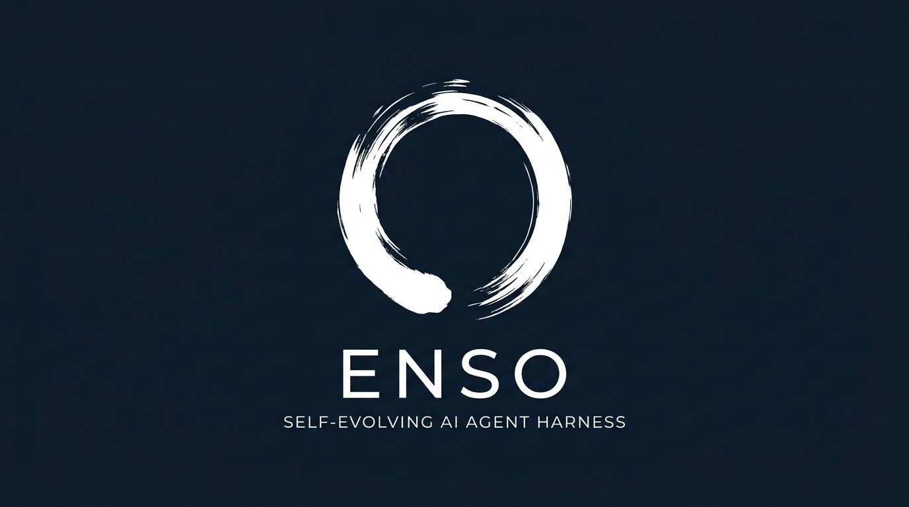
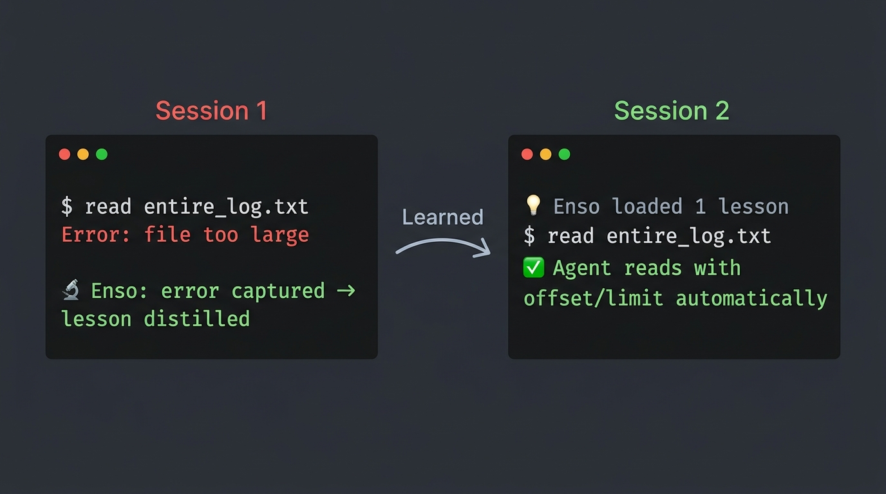
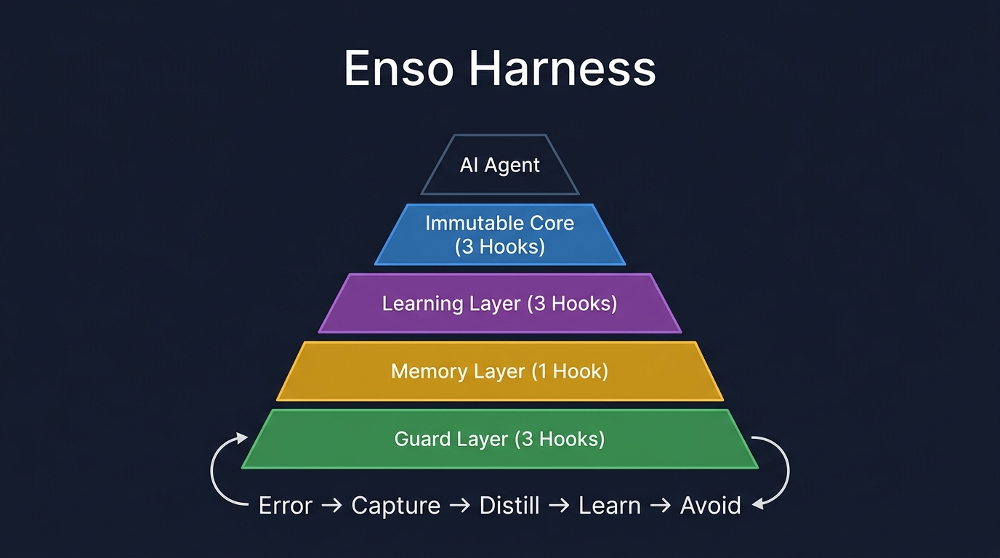

<p align="center">
  
</p>

<p align="center">
  <a href="LICENSE"></a>
  <a href="#"></a>
  <a href="#"></a>
  <a href="#"></a>
  <a href="#"></a>
</p>

<p align="center">
  <a href="#快速开始">快速开始</a> •
  <a href="#enso-提供什么">定位</a> •
  <a href="#怎么工作的">原理</a> •
  <a href="#遗忘">遗忘</a> •
  <a href="#健康检查">检查</a> •
  <a href="README.md">English</a>
</p>

---

## Enso 不是记忆系统，是纪律系统。

一个轻量插件，包裹在任何 AI Agent 外面——Claude Code、Hermes、OpenClaw、Gemini CLI——添加代码强制学习、主动遗忘和自我保护。

<p align="center">
  
</p>

## 快速开始

```bash
git clone https://github.com/amazinglvxw/enso-os.git
cd enso-os && bash install.sh
```

安装脚本自动检测你的 Agent，也可以手动指定目标：

```bash
bash install.sh --target claude-code    # Claude Code（默认）
bash install.sh --target gemini-cli     # Gemini CLI
bash install.sh --target hermes         # Hermes Agent
bash install.sh --target openclaw       # OpenClaw
bash install.sh --target generic        # 通用模式（任何支持 Hook 的 Agent）
```

**就这样。** 开始新会话，Enso 自动生效：

```
会话 1:  你遇到一个错误 → Enso 自动捕获
         会话结束 → Enso 从错误中蒸馏 1-3 条教训

会话 2:  Enso 注入教训 → Agent 自动避免同样的错误
         你什么都不用做。系统自己学会了。
```

## Enso 提供什么

Enso 和你的宿主 Agent 是互补关系，不是竞争：

| Enso 提供什么 | 宿主 Agent 负责什么 |
|---------------|---------------------|
| 代码强制的错误学习 | 上下文管理与压缩 |
| 主动遗忘（衰减 + LRU + Lint） | 多模型编排 |
| 不可变自我保护（3 个 Hook） | 平台集成与 UI |
| 知识质量检查（每周 Lint） | 工具执行与调用 |

| Enso 强制执行（拦截违规） | Enso 审计（记录 + 警告） |
|---------------------------|--------------------------|
| 自我保护：Agent 不能修改自身 Hook | 写入验证：追踪未验证的写入 |
| 安全扫描：拦截记忆文件中的密钥/注入 | 记忆预算：MEMORY.md 过大时警告 |

> Enso 不替代你的 Agent。它让你的 Agent 更有纪律。就像 AI 的 SELinux。

## 兼容框架

| 能力 | Claude Code | Gemini CLI | Hermes | OpenClaw | 通用 |
|------|:-----------:|:----------:|:------:|:--------:|:----:|
| 错误捕获 + 蒸馏 | ✅ | ✅ | ✅ | ✅ | ✅ |
| 教训注入（SessionStart） | ✅ | ✅ | ✅ | ✅ | ✅ |
| 工具调用追踪 | ✅ | ✅ | ✅ | ✅ | ✅ |
| 主动遗忘 + 维护 | ✅ | ✅ | ✅ | ✅ | ✅ |
| 自我保护（core-readonly） | ✅ | ✅ | — | — | — |
| 记忆安全扫描 | ✅ | ✅ | — | — | — |
| 记忆预算守护 | ✅ | ✅ | — | — | — |
| 写入验证审计 | ✅ | ✅ | — | — | — |

Pre-tool-use Hook（自我保护、安全扫描、预算守护、写入验证）需要框架支持"工具执行前"生命周期事件。Hermes、OpenClaw 和通用目标可获得完整的学习 + 遗忘循环，但没有守护层。

## 怎么工作的

<p align="center">
  
</p>

**10 个 Hook，4 层生命周期。** 代码强制执行，Agent 无法跳过。

| 层 | Hook 数 | 做什么 |
|----|---------|--------|
| 🔒 **不可变层** | 3 | 写入必须验证。不能修改自身规则。会话结束审计。 |
| 🧠 **学习层** | 3 | 记录每次工具调用。捕获错误。LLM 异步蒸馏教训。 |
| 💡 **记忆层** | 1 | 下次会话注入教训 + 知识 + 智慧。 |
| 🛡️ **守护层** | 3 | 记忆预算上限。拦截密钥/注入攻击。自动维护。 |

**核心循环：**
```
错误 → 捕获（代码强制）→ 蒸馏（异步）→ 存储 → 下次注入 → 避免
```

不是 Agent "选择"学习。是系统**让它必须**学习。

## 遗忘

大多数记忆系统只增长。Enso 主动遗忘——因为[不遗忘比遗忘更危险](https://arxiv.org/abs/2603.13428)。

| 机制 | 做什么 |
|------|--------|
| 过时衰减 | 教训 >37 天未使用 → 删除 |
| LRU 淘汰 | 超过 50 条 → 最旧的被淘汰 |
| MEMORY.md 下沉 | 已完成项 → 归档 |
| Trace 轮转 | >14 天 → 删除（每日 cron） |
| 恢复安全网 | 被删教训的错误再次出现 → 标记复查 |

## 健康检查

`enso-lint.sh` 每周运行——知识库的 CI/Lint：

| 检查项 | 发现什么 |
|--------|---------|
| 孤岛 | 从未使用的教训（hits:0，>7 天） |
| 重复 | 关键词重叠 >60% 的教训 |
| 弱教训 | 没有可执行动词——无法指导行动 |
| 预算 | MEMORY.md 容量状态 |

每次蒸馏自动重建 `lessons/INDEX.md` 索引，加速路由。

## 架构

```
~/.enso/
├── core/                          # 共享模块
│   ├── env.sh                     # 路径、enso_parse()、enso_find_memory_file()
│   ├── parse-hook-input.py        # 所有 Hook 的 JSON 解析器
│   ├── dikw-utils.py              # DIKW 操作（7 个子命令）
│   ├── enso-lint.sh               # 🔍 每周健康检查
│   ├── rebuild-index.py           # 📇 自动重建 INDEX.md
│   └── deleted-lessons-tracker.py # 🔄 恢复安全网
├── hooks/                         # 10 个生命周期 Hook
│   ├── pre-tool-use/              # 🔒🛡️ core-readonly, budget-guard, safety-scan
│   ├── post-tool-use/             # 🔒🧠 physical-verification, trace-emission
│   ├── post-tool-use-failure/     # 🧠 error-seed-capture
│   ├── stop/                      # 🔒🧠🛡️ audit, distill, maintenance
│   └── session-start/             # 💡 load-lessons
├── dikw/                          # DIKW 蒸馏（信息 → 知识 → 智慧）
├── traces/                        # 工具调用日志 + Lint 报告
└── lessons/                       # active.md + INDEX.md
```

<details>
<summary><strong>哲学："约束是灵活的地基"</strong></summary>

像生物进化：DNA 提供不可变约束（蛋白质折叠物理定律），但在约束之内，生命找到无穷的创造性解法。

- **3 个不可变 Hook** = 地基（永不改变）
- **其他一切** = 自由进化
- **主动遗忘** = 防止僵化

基于 100+ 篇论文、5 个月日常使用提炼：

| 来源 | 核心洞察 |
|------|---------|
| [OpenAI Harness Engineering](https://openai.com/index/harness-engineering/) | 规则写在代码里，不写在 Prompt 里 |
| [Agent Lightning (Microsoft)](https://github.com/microsoft/agent-lightning) | Trace/Span + Hook/Emission 双层架构 |
| [fireworks-skill-memory](https://github.com/yizhiyanhua-ai/fireworks-skill-memory) | 200 行 Hook > 800 行 Prompt |
| [SWE-agent (NeurIPS 2024)](https://github.com/SWE-agent/SWE-agent) | 受约束的接口降低错误率 |

</details>

<details>
<summary><strong>生存实验</strong></summary>

这个项目的 GitHub 指标就是它的进化适应度信号：

- ⭐ Star = 生存验证（"这个有用"）
- 🍴 Fork = 繁衍（"我要基于它构建"）
- 🐛 Issue = 选择压力（"这里需要改进"）

维护这个仓库的 Agent 监控这些信号。好用就活，不好用就死。

</details>

## FAQ

**Q: 支持哪些 AI Agent？**
Claude Code（主要目标，全面测试，每日 dogfooding）、Gemini CLI、Hermes Agent、OpenClaw，以及任何支持生命周期 Hook 的通用 Agent。

**Q: 数据存在哪？**
100% 本地。`~/.enso/` 在你的机器上。无云、无 Docker、无数据库。

**Q: 和 Mem0 / LangChain Memory 有什么区别？**
它们存事实。Enso 从错误中学习——并主动遗忘不再有用的东西。

**Q: 前提条件？**
`bash` 和 `python3`（3.6+）。macOS 和大多数 Linux 自带。不需要 pip、npm、Docker。

**Q: 安装后需要配置什么？**
不需要。`bash install.sh` 注册所有 Hook。下次会话自动生效。

**Q: 为什么不直接用 Claude Code 自带的记忆？**
Claude Code 的 Auto Memory 适合存事实，但有 200 行静默截断、不从错误中学习、没有主动遗忘、没有质量检查。Enso 在上面补齐这些缺失层。

## 贡献

见 [CONTRIBUTING.md](CONTRIBUTING.md)。最有价值的贡献：
- 🐛 带复现步骤的 Bug 报告
- 💡 新的 Hook 创意
- 🧪 与其他 Agent 的兼容性测试

## 许可

MIT。见 [LICENSE](LICENSE)。

---

<p align="center">
  <em>禅书法中，圆相一笔画成——不完美、不完整、美。<br>
  这个系统永远不会完美。但它会一直进化。</em>
</p>
